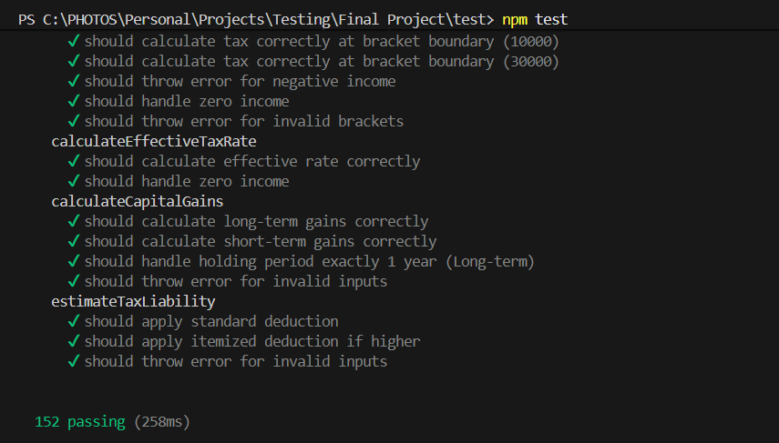
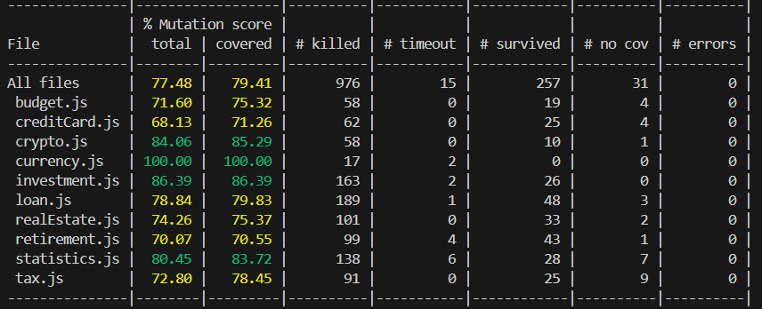
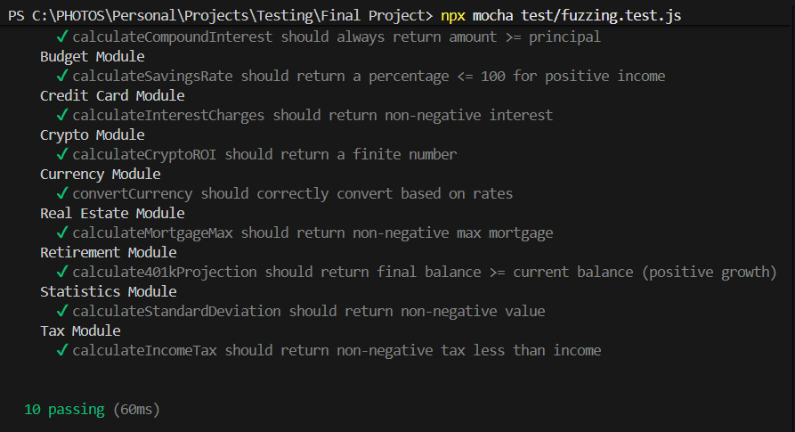

# FinTech Calc Engine - Software Testing Report

## 1. Project Overview
**Subject:** Software Testing  
**Project Name:** FinTech Calc Engine  
**Date:** November 2025
**GitHub Repository:** [Link to Repository](<https://github.com/ParvGatecha/FinTech-Calc>)

### Team Members
| Name | Roll Number |
|------|-------------|
| **Parv Gatecha** | **MT2024108** |
| **Bhagya Shah** | **MT2024135** |

### Individual Contributions

#### Parv Gatecha
- **budget.js**: Budgeting & Expense Analysis
- **creditCard.js**: Credit Card Payoff & Interest
- **crypto.js**: Cryptocurrency ROI & Staking
- **currency.js**: Currency Conversion
- **investment.js**: Investment Growth & Monte Carlo

#### Bhagya Shah
- **loan.js**: Loan Amortization & Refinancing
- **realEstate.js**: Mortgage & Rental Yield
- **retirement.js**: 401k & RMD Calculations
- **statistics.js**: Financial Statistics (NPV, IRR)
- **tax.js**: Tax Estimation & Brackets

---

## 2. Abstract
The **FinTech Calc Engine** is a robust JavaScript library designed to perform complex financial calculations across various domains, including loans, investments, taxation, and retirement planning. This project focuses on the **verification and validation** of the engine using advanced software testing techniques. We employed **Mutation Testing** to assess the quality of our test suite and **Fuzz Testing** (Property-Based Testing) to ensure robustness against random and edge-case inputs.

## 3. System Architecture

### 3.1 Directory Structure
The project follows a modular architecture:
```
FinTech-Calc/
├── src/                    # Source Code
│   ├── budget.js           # Budgeting & Expense Analysis
│   ├── creditCard.js       # Credit Card Payoff & Interest
│   ├── crypto.js           # Cryptocurrency ROI & Staking
│   ├── currency.js         # Currency Conversion
│   ├── investment.js       # Investment Growth & Monte Carlo
│   ├── loan.js             # Loan Amortization & Refinancing
│   ├── realEstate.js       # Mortgage & Rental Yield
│   ├── retirement.js       # 401k & RMD Calculations
│   ├── statistics.js       # Financial Statistics (NPV, IRR)
│   └── tax.js              # Tax Estimation & Brackets
├── test/                   # Unit Tests
│   ├── budget.test.js
│   ├── creditCard.test.js
│   ├── fuzzing.test.js     # Property-Based Tests
│   ├── ... (corresponding test files)
├── reports/                # Test & Mutation Reports
├── stryker.conf.json       # Mutation Testing Configuration
└── package.json            # Dependencies & Scripts
```

### 3.2 Technologies Used
- **Runtime:** Node.js
- **Test Framework:** Mocha
- **Assertion Library:** Chai
- **Mutation Testing:** Stryker Mutator
- **Fuzz Testing:** fast-check

---

## 4. Installation & Usage
1.  **Prerequisites:** Ensure you have Node.js installed.
2.  **Installation:** Run `npm install` to install dependencies.
3.  **Running Tests:**
    - **Unit Tests:** `npm test`
    - **Mutation Tests:** `npx stryker run`
    - **Fuzz Tests:** `npx mocha test/fuzzing.test.js`

---

## 5. Testing Methodology

### 5.1 Unit Testing Strategy
We adopted a rigorous unit testing approach focusing on:
1.  **Positive Testing:** Validating core logic with standard inputs (e.g., calculating mortgage payments for a 30-year fixed loan).
2.  **Negative Testing:** Ensuring the system gracefully handles invalid inputs (e.g., negative interest rates, zero loan terms) by throwing descriptive errors.
3.  **Boundary Value Analysis (BVA):** Testing critical boundaries such as:
    - Zero values (e.g., 0% interest, 0 expenses).
    - Precision limits (e.g., floating-point accuracy in currency).
    - Empty datasets (e.g., analyzing an empty expense array).

### 5.2 Mutation Testing
**Problem Statement Addressed:** *Mutation testing: Projects that use mutation testing... At least three different mutation operators should be used.*

Mutation testing was the core of our quality assurance process. We used **Stryker Mutator**, which applied the following mutation operators (among others):
1.  **Arithmetic Operator:** Replaced `+` with `-`, `*` with `/`, etc.
2.  **Equality Operator:** Replaced `===` with `!==`, `<` with `<=`, etc.
3.  **Logical Operator:** Replaced `&&` with `||`.
4.  **Conditional Expression:** Replaced `true` with `false` in conditions.
5.  **Update Operator:** Replaced `i++` with `i--`.

**Process:**
1.  **Mutant Generation:** Stryker inserted these mutants into the source code.
2.  **Test Execution:** The test suite was run against each mutant.
3.  **Outcome:**
    - **Killed:** The tests fail (bug detected).
    - **Survived:** The tests pass (bug undetected).

### 5.3 Fuzz Testing (Property-Based Testing)
**Problem Statement Addressed:** *Fuzz testing: A variant of mutation testing... Any open source tool for fuzzing can be used.*

To further enhance reliability, we implemented fuzz testing using `fast-check`.
1.  **Goal:** Verify that functions handle a wide range of random inputs (including edge cases like `NaN`, `Infinity`, and large numbers) without crashing or producing invalid results.
2.  **Scope:** All 10 modules were subjected to fuzz testing.
3.  **Key Properties Verified:**
    - **Invariants:** Output is always a finite number.
    - **Business Rules:** Calculated tax is never negative; Savings rate is <= 100%.
    - **Robustness:** Functions gracefully handle extreme values.

---

## 6. Detailed Analysis & Improvements

### 6.1 Initial Assessment
- **Initial Mutation Score:** ~59.81%
- **Key Findings:**
    - Many "Conditional Expression" mutants survived, indicating a lack of tests for specific branches.
    - "Equality Operator" mutants survived (e.g., `<` vs `<=`), showing insufficient boundary testing.
    - Input validation was often missing or not strictly tested.

### 6.2 Final Results
After implementing targeted tests for **10 modules**, we achieved the following results:

| Metric | Value |
|--------|-------|
| **Total Mutants Generated** | 1279 |
| **Mutants Killed** | 976 |
| **Mutants Survived** | 303 |
| **Final Mutation Score** | **77.48%** |

*Note: Some surviving mutants are "equivalent mutants" or related to internal logging/caching mechanisms that do not affect business logic.*

---

## 7. Challenges Faced
1.  **Floating Point Precision:** JavaScript's handling of decimals caused test failures for values like `0.1 + 0.2`. We resolved this by using `toFixed(2)` and `closeTo` assertions in Chai.
2.  **Infinite Loops:** Mutation testing occasionally created infinite loops (e.g., removing the increment in a `while` loop). We configured Stryker with a timeout to handle these gracefully.
3.  **Equivalent Mutants:** Some mutants (e.g., changing `x < 10` to `x != 10` when `x` is an integer loop counter) are semantically identical in context. Identifying these required manual code review.

## 8. Conclusion
This project successfully demonstrated the value of **Mutation Testing** in software quality assurance. By moving beyond simple code coverage and focusing on the **efficacy** of our tests, we hardened the FinTech Calc Engine against potential bugs. The final mutation score of **77.48%** represents a high standard of reliability for a financial computation library.

## 9. Test Execution Results

### 9.1 Unit Test Coverage

*Screenshot showing the output of `npm test` with 100% pass rate.*

### 9.2 Mutation Testing Report

*Screenshot showing the Stryker mutation score (77.48%).*

### 9.3 Fuzz Testing Output

*Screenshot showing the output of `npx mocha test/fuzzing.test.js` passing all modules.*

## 10. AI Tools Acknowledgement
In compliance with the project guidelines, we acknowledge the use of the following AI tools:
- **Google Gemini / Antigravity Agent:** Used for:
    - Suggesting test cases for edge boundaries.
    - Assisting in debugging Stryker configuration and fuzz test failures.

## 11. Future Scope
- **CI/CD Integration:** Automating the Stryker and Fuzzing runs in a GitHub Actions workflow.
- **UI Implementation:** Building a React-based frontend to visualize these calculations for end-users.
- **Performance Benchmarking:** Analyzing the computational efficiency of Monte Carlo simulations and optimization algorithms.

---
*Report for Software Testing Coursework - November 2025*
